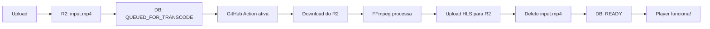

# 🎬 Video Processor Setup Guide

Este guia explica como configurar o processamento automático de vídeos usando GitHub Actions.

## 📋 O que o Processor faz:

1. ✅ Gera **thumbnail** (frame em 1 segundo)
2. ✅ Gera **teaser** (preview de 10 segundos em 720p)
3. ✅ Detecta resolução original
4. ✅ Gera **HLS multi-bitrate** (1080p, 720p, 480p, 360p)
5. ✅ Upload de tudo para Cloudflare R2
6. ✅ Deleta o vídeo original (economiza espaço)
7. ✅ Atualiza o banco de dados

## 🚀 Setup Rápido

### 1. Adicione seu script de processamento

Crie o arquivo `scripts/process-videos.js` no seu repositório com o código do processor.

### 2. Configure os Secrets no GitHub

Vá em **Settings → Secrets and variables → Actions** e adicione:

```
R2_ACCOUNT_ID          = seu-account-id
R2_ACCESS_KEY_ID       = sua-access-key
R2_SECRET_ACCESS_KEY   = sua-secret-key
R2_BUCKET_NAME         = video-storage
APP_URL                = https://sua-app.vercel.app
PROCESSOR_API_KEY      = gere-uma-chave-segura
```

**Gerar PROCESSOR_API_KEY:**
```bash
openssl rand -hex 32
```

### 3. Adicione a mesma chave no .env da sua app

```env
PROCESSOR_API_KEY="mesma-chave-do-github"
```

### 4. Ative o GitHub Action

O workflow está em `.github/workflows/process-video.yml` e pode ser disparado de 3 formas:

#### A) Manualmente (para testes):
1. Vá em **Actions** no GitHub
2. Selecione "Process Video"
3. Clique em "Run workflow"

#### B) Via webhook após upload:
Adicione na API de upload completo:
```typescript
// app/api/videos/mark-upload-complete/route.ts
await fetch('https://api.github.com/repos/SEU_USER/SEU_REPO/dispatches', {
  method: 'POST',
  headers: {
    'Authorization': `token ${process.env.GITHUB_TOKEN}`,
    'Content-Type': 'application/json',
  },
  body: JSON.stringify({
    event_type: 'process_video',
  }),
});
```

#### C) Via cron (a cada X minutos):
Adicione no workflow:
```yaml
on:
  schedule:
    - cron: '*/15 * * * *'  # A cada 15 minutos
```

## 📁 Estrutura de Arquivos no R2

Após o processamento:

```
videos/{videoId}/
├── input.mp4              ← Original (será deletado)
├── thumb.jpg              ← Thumbnail
├── teaser.mp4             ← Preview 10s
└── hls/
    ├── master.m3u8        ← Master playlist
    ├── 1080p/
    │   ├── playlist.m3u8
    │   ├── seg000.ts
    │   ├── seg001.ts
    │   └── ...
    ├── 720p/
    │   ├── playlist.m3u8
    │   └── ...
    ├── 480p/
    │   └── ...
    └── 360p/
        └── ...
```

## 🎯 Controle de Qualidade por Tier

Você pode controlar quais qualidades gerar por usuário/tier:

```typescript
// Ao criar o vídeo, defina videoQualityHeights
await prisma.video.create({
  data: {
    // ... outros campos
    videoQualityHeights: [720, 1080], // Apenas 720p e 1080p
  },
});
```

**Qualidades disponíveis:**
- `1080` = 1920x1080 @ 4Mbps
- `720` = 1280x720 @ 1.5Mbps
- `480` = 854x480 @ 800Kbps
- `360` = 640x360 @ 400Kbps

**Default:** `[720, 1080]`

## 🔍 Monitoramento

### Ver logs do processamento:
1. Vá em **Actions** no GitHub
2. Clique no workflow em execução
3. Veja os logs detalhados

### Verificar progresso na app:
```typescript
const video = await prisma.video.findUnique({
  where: { id },
  select: {
    processingProgress, // 0-100
    hlsProcessed,       // true quando concluído
    status,             // READY quando pronto
  },
});
```

## 🐛 Troubleshooting

### Workflow não inicia:
- Verifique se os secrets estão configurados
- Confirme que o workflow está habilitado em Actions

### Erro de autenticação:
- Verifique se `PROCESSOR_API_KEY` é igual no GitHub e na app
- Confirme que `APP_URL` está correto

### Vídeo não processa:
- Verifique se o status é `QUEUED_FOR_TRANSCODE`
- Confirme que `hlsProcessed = false`
- Veja os logs no GitHub Actions

### FFmpeg falha:
- Vídeo pode estar corrompido
- Codec não suportado (use H.264)
- Arquivo muito grande (limite de 2GB no GitHub Actions)

## 📊 Custos

**GitHub Actions:**
- ✅ 2000 minutos/mês grátis (contas públicas)
- ✅ Processamento rápido (~5min por vídeo)
- ✅ Escalável automaticamente

**Cloudflare R2:**
- ✅ 10 GB armazenamento grátis
- ✅ Sem custos de egress
- ✅ Uploads ilimitados

## 🔄 Fluxo Completo



## 🎉 Pronto!

Agora sua plataforma processa vídeos automaticamente:

1. Usuário faz upload
2. GitHub Action processa em background
3. Vídeo fica disponível em HLS
4. Player funciona com adaptive bitrate

---

**Precisa de ajuda?** Veja os logs no GitHub Actions ou revise a configuração dos secrets.
